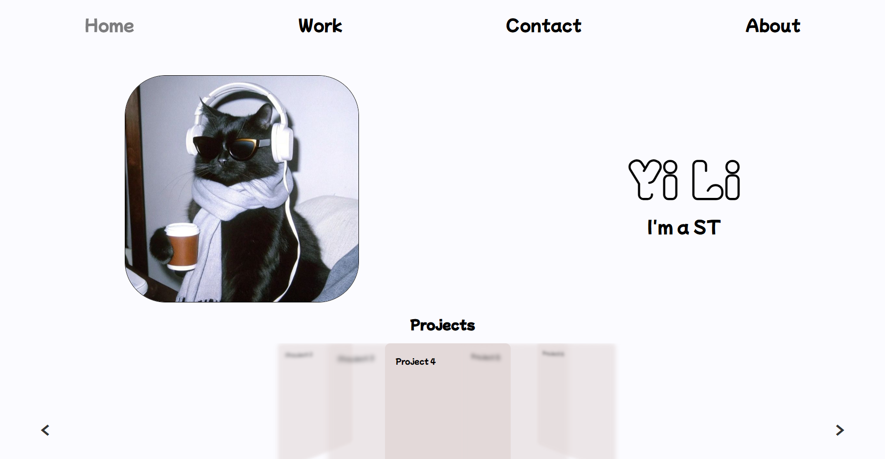

# Finals Documentation

### Link: http://127.0.0.1:5500/Midterm/home/portfolio.html



### Short Summary:
My project is a personal portfolio page. Showing off my work as a designer and potentially developer.

### A code snippet I'm proud of: 
``` CSS
.floating-text {
    width: 100%;
    height: 100%;
    background: rgba(rgb(226, 224, 224), rgb(226, 224, 224), rgb(226, 224, 224), 0.8);
    backdrop-filter: blur(10px);
    position: absolute; 
    display: flex;
    justify-content: center;
    align-items: center;
    font-size: 3rem;
    font-weight: bold;
    font-family: 'Mochiy Pop One', sans-serif;
    color: #000000;
    pointer-events: none;
    animation: glideToCenter 1s ease-out forwards; 
}
```
This is part of a bigger code but essentially, this CSS styles the text that shows up when transitioning between pages. It also blurs the entire page while the text is being shown. The blur part is what I'm most proud of.

### Struggle
Something I struggled with was definitely the animation with the navigations, it was very hard setting it up and making sure it worked as intended. Even with the help of Claude AI, it took a while to accomplish

### Proud of

Something I'm proud of is the image popups because it made the images look better in terms of quality when they're scaled down and when clicked on, it expands the image into its full size, rather it be horizontally or vertically.

### What I would add if I had more time
Definitely some designs or 3D elements just to give my website more life especially on the contact and about page
